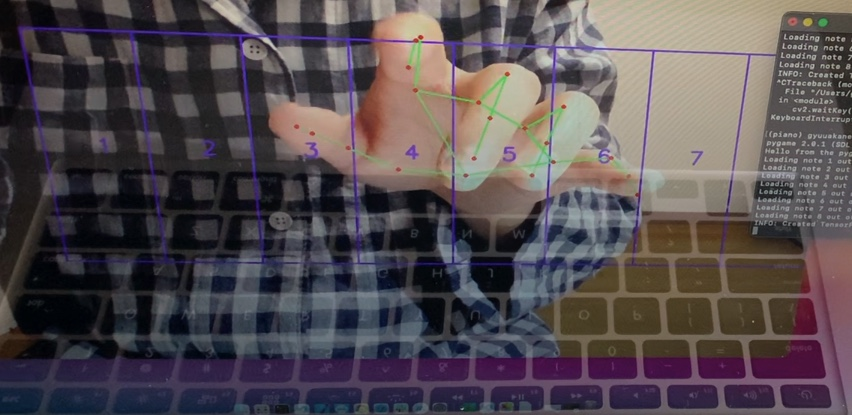

# Karapia
This is a virtual piano program. With your webcam, you can make some sound by just touching the air!

 

This work was based on Pianoputer(https://github.com/Zulko/pianoputer) and mediapipe(https://github.com/google/mediapipe).

run it just by: `python run.py`
Then hit the keys while looking at the screen.

This work is very unstable now, and therefore many mistaken detections will happen. But anyway, it's fun!

## essential packages
* librosa >= 0.8.0
* pygame >= 2.0.0
* keyboardlayout >= 2.0.1
* opencv-python
* mediapipe